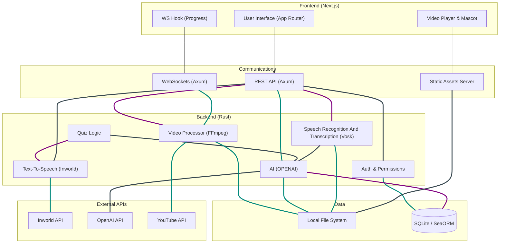

# System Block Diagram

Note, colored lines are just for readability purposes. They don't have any other meaning

```mermaid
graph TD
    subgraph Frontend ["Frontend (Next.js)"]
        direction LR
        UI["User Interface (App Router)"]
        WSH["WS Hook (Progress)"]
        AV["Video Player & Mascot"]
    end

    subgraph Comm ["Communications"]
        direction LR
        API["REST API (Axum)"]
        WSS["WebSockets (Axum)"]
        Assets["Static Assets Server"]
    end

    subgraph Backend ["Backend (Rust)"]
        direction LR
        TTS["Text-To-Speech (Inworld)"]
        Quiz["Quiz Logic"]
        AI["AI (OPENAI)"]
        Vosk["Speech Recognition And Transcription (Vosk)"]
        Video_P["Video Processor (FFmpeg)"]
        Auth["Auth & Permissions"]
    end

    subgraph External ["External APIs"]
        direction LR
        INWORLD_API["Inworld API"]
        OPENAI_API["OpenAI API"]
        YT["YouTube API"]
    end

    subgraph Storage ["Data"]
        direction LR
        FS["Local File System"]
        DB[(SQLite / SeaORM)]
    end

    %% Frontend to Communications
    UI --> API
    WSH --- WSS
    AV <--- Assets

    %% Communications to Backend Hubs
    API --- Auth
    API --- AI
    API --- Video_P
    API --- Vosk
    WSS --- Video_P

    %% Internal Backend Logic
    Quiz --- AI
    Vosk --- AI
    Quiz --- TTS
    API --- TTS

    %% Backend to External APIs
    TTS --- INWORLD_API
    AI --- OPENAI_API
    Video_P --- YT

    %% Backend to Data
    Auth --- DB
    AI --- DB
    Video_P --- FS
    AI --- FS
    Vosk --- FS
    Assets --- FS

    %% Color Coding and Line Styling
    linkStyle 3 stroke:#37474f,stroke-width:3px;
    linkStyle 4 stroke:#00897b,stroke-width:3px;
    linkStyle 5 stroke:#800080,stroke-width:3px;
    linkStyle 6 stroke:#800080,stroke-width:3px;
    linkStyle 7 stroke:#00897b,stroke-width:3px;
    linkStyle 8 stroke:#37474f,stroke-width:3px;
    linkStyle 9 stroke:#37474f,stroke-width:3px;
    linkStyle 10 stroke:#800080,stroke-width:3px;
    linkStyle 11 stroke:#37474f,stroke-width:3px;
    linkStyle 12 stroke:#00897b,stroke-width:3px;
    linkStyle 13 stroke:#37474f,stroke-width:3px; 
    linkStyle 14 stroke:#00897b,stroke-width:3px;
    linkStyle 15 stroke:#00897b,stroke-width:3px;
    linkStyle 16 stroke:#800080,stroke-width:3px;
    linkStyle 17 stroke:#00897b,stroke-width:3px;
    linkStyle 18 stroke:#00897b,stroke-width:3px;
    linkStyle 19 stroke:#00897b,stroke-width:3px;
    linkStyle 20 stroke:#37474f,stroke-width:3px;
```
