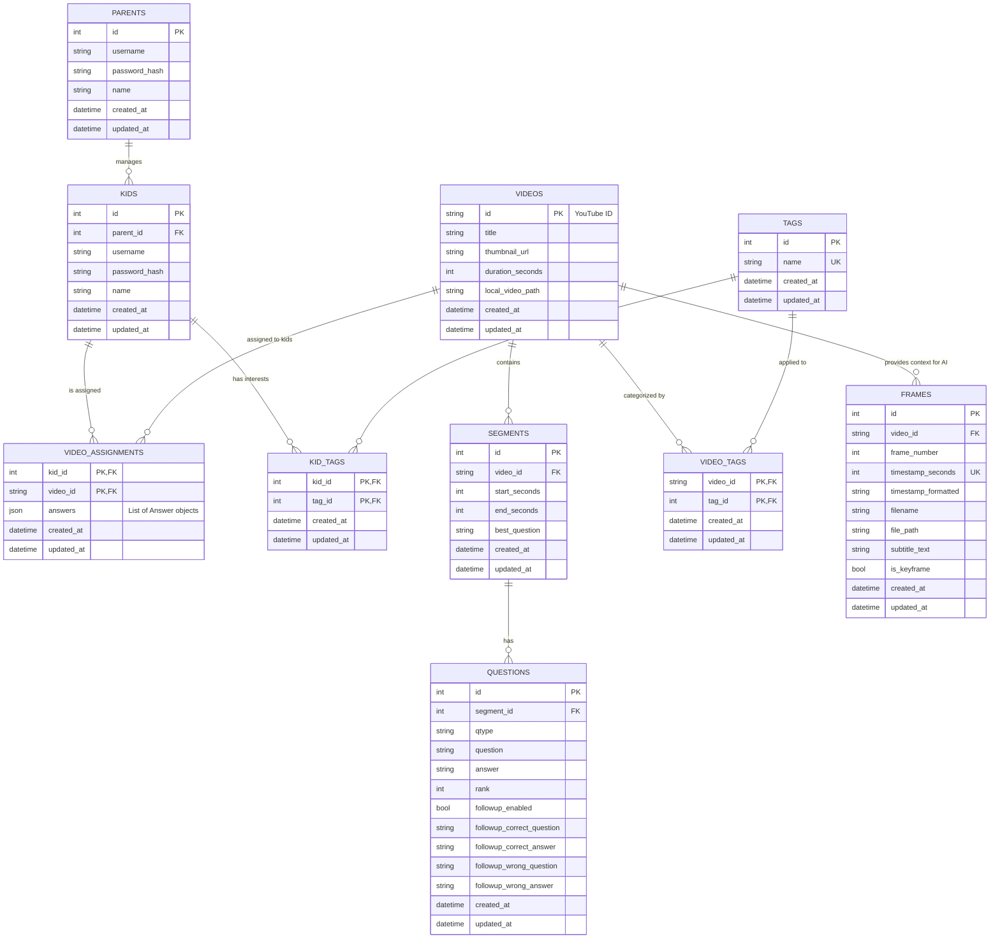

# ERD Diagram

```mermaid
erDiagram
    PARENTS ||--o{ KIDS : "manages"
    KIDS ||--o{ VIDEO_ASSIGNMENTS : "is assigned"
    KIDS ||--o{ KID_TAGS : "has interests"
    
    VIDEOS ||--o{ VIDEO_ASSIGNMENTS : "assigned to kids"
    VIDEOS ||--o{ SEGMENTS : "contains"
    VIDEOS ||--o{ VIDEO_TAGS : "categorized by"
    VIDEOS ||--o{ FRAMES : "provides context for AI"
    
    SEGMENTS ||--o{ QUESTIONS : "has"
    
    TAGS ||--o{ VIDEO_TAGS : "applied to"
    TAGS ||--o{ KID_TAGS : "describes"

    PARENTS {
        int id PK
        string username
        string password_hash
        string name
        datetime created_at
        datetime updated_at
    }

    KIDS {
        int id PK
        int parent_id FK
        string username
        string password_hash
        string name
        datetime created_at
        datetime updated_at
    }

    VIDEOS {
        string id PK "YouTube ID"
        string title
        string thumbnail_url
        int duration_seconds
        string local_video_path
        datetime created_at
        datetime updated_at
    }

    SEGMENTS {
        int id PK
        string video_id FK
        int start_seconds
        int end_seconds
        string best_question
        datetime created_at
        datetime updated_at
    }

    FRAMES {
        int id PK
        string video_id FK
        int frame_number
        int timestamp_seconds UK
        string timestamp_formatted
        string filename
        string file_path
        string subtitle_text
        bool is_keyframe
        datetime created_at
        datetime updated_at
    }

    QUESTIONS {
        int id PK
        int segment_id FK
        string qtype
        string question
        string answer
        int rank
        bool followup_enabled
        string followup_correct_question
        string followup_correct_answer
        string followup_wrong_question
        string followup_wrong_answer
        datetime created_at
        datetime updated_at
    }

    VIDEO_ASSIGNMENTS {
        int kid_id PK, FK
        string video_id PK, FK
        json answers "List of Answer objects"
        datetime created_at
        datetime updated_at
    }

    TAGS {
        int id PK
        string name UK
        datetime created_at
        datetime updated_at
    }

    VIDEO_TAGS {
        string video_id PK, FK
        int tag_id PK, FK
        datetime created_at
        datetime updated_at
    }

    KID_TAGS {
        int kid_id PK, FK
        int tag_id PK, FK
        datetime created_at
        datetime updated_at
    }
```
