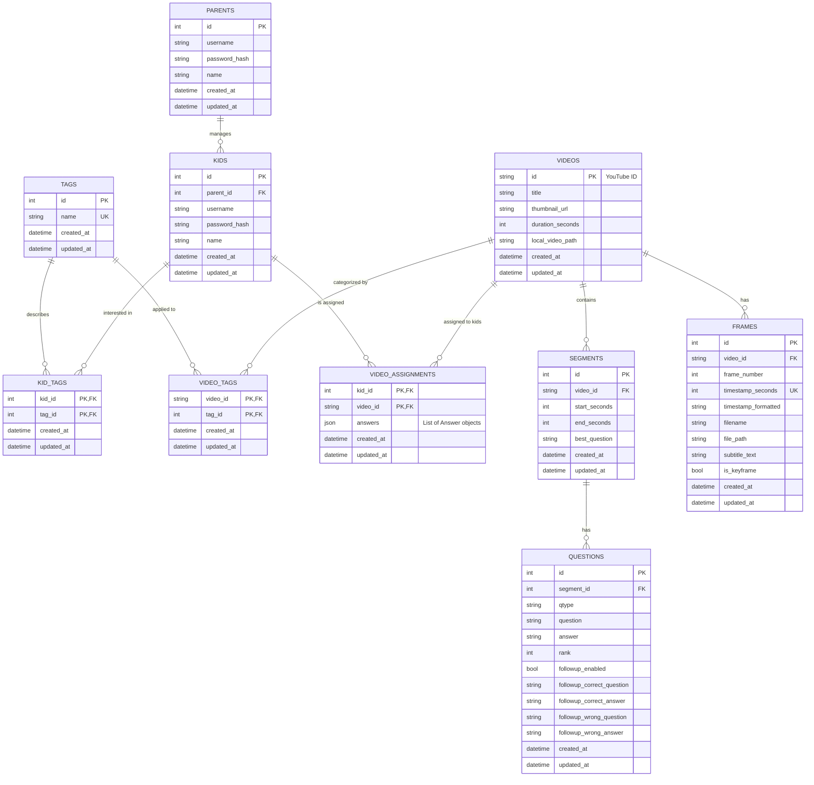

# ERD

## ERD Diagram Explanation
1. Parent to Kids : A parent account may add multiple kids attached to their account and manage them but start with no kids. A Kid account may only be attached to one parent account. This allows parent accounts to ,manage kid accounts.
2. Kids to Kid_Tags : Parents can attach multiple tags to the Kid account, relating to what the kid is interested in. 
3. Tags to Kid_Tags : Kid Tags link a Kid account to the main tag which describes the tag definition. This is used in the reccomendation algorithm. The algorithm connects what the Kid is interested in, to the video with what they are interested in.
4. Tags to Video_Tags : Video tags link the main tag to the Videos entity. A video may have multiple tags on it, but each tag on the video is linked to a main tag. Main tag describes what the tag is. This is also used in the reccomendation algorithm.
5. Videos to Video_Tags : Each Video can have multiple tags attached to it, relating to what the topic of the video is about. Parents can add new tags for future users.
6. Video to Video Assignments to Kids : Multiple videos can be assigned to Kids by the parent account. Each Kid account can have multiple videos assigned to them. Each Video Assignment must assign only one video to one kid. 
7. Videos to Frames : Each Video has multiple frames which are sent to AI to generate questions for the videos.
8. Videos to Segments to Questions : Each Video is split into many segments where each segment can have multiple questions attached to them in order to quiz the kid.
