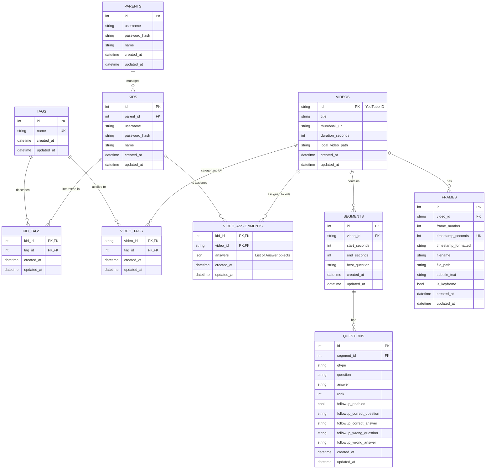

# ERD

## ERD Diagram Explanation
1. Parent <-> Kids : A parent account may add multiple kids attached to their account and manage them but start with no kids. A Kid account may only be attached to one parent account. This allows parent accounts to ,manage kid accounts.
2. Kids <-> Kid_Tags : Parents can attach multiple tags to the Kid account, relating to what the kid is interested in. 
3. Tags <-> Kid_Tags : Kid Tags link a Kid account to the main tag which describes the tag definition. This is used in the reccomendation algorithm. The algorithm connects what the Kid is interested in, to the video with what they are interested in.
4. Tags <-> Video_Tags : Video tags link the main tag to the Videos entity. A video may have multiple tags on it, but each tag on the video is linked to a main tag. Main tag describes what the tag is. This is also used in the reccomendation algorithm.
5. Videos <-> Video_Tags : Each Video can have multiple tags attached to it, relating to what the topic of the video is about. Parents can add new tags for future users.
6. Video <-> Video Assignments <-> Kids : Multiple videos can be assigned to Kids by the parent account. Each Kid account can have multiple videos assigned to them. Each Video Assignment must assign only one video to one kid. 
7. Videos <-> Frames : Each Video has multiple frames which are sent to AI to generate questions for the videos.
8. Videos <-> Segments <-> Questions : Each Video is split into many segments where each segment can have multiple questions attached to them in order to quiz the kid.

## Reason For Design
The database is designed specifically to support the operations of our app, PiggyBack Learning. The relationship between the Parents and Kids tables gives the parent abilities to manage the Kid account, and allows for multiple Kids under one account. The username and passwords allow for account creation and login. The Videos are broken down into Segments (interval specified by the parent), in order to allow the app to pause videos at certain timestamps to run quizzes. The Frames allow the video to be broken up into multiple frames for deeper analysis by the AI in order to generate questions. The Tags which are joined via Video_Tags and Kid_Tags allows us to easily implement a reccomendation model that matches a kids interests with what a video contains. The Video_Assignments table connects Videos to Kid accounts, which is controlled by the Parent account. The reason why answers is stored as a JSON blob is because it makes it easier to update the structure of "answers" ,which consists of many objects, while decreasing the frequency of schema migrations. The Videos are split into frames represented by the Frame table is to assist the AI in generating questions based on the video. The reason why Videos are split into Segments in the database is to make it easier to store questions generated and to facilitate the quiz, as there will be questions generated based on each segment. Each question will have followup questions if the user answer incorrectly, hence the fields that start with 'followup'. 
