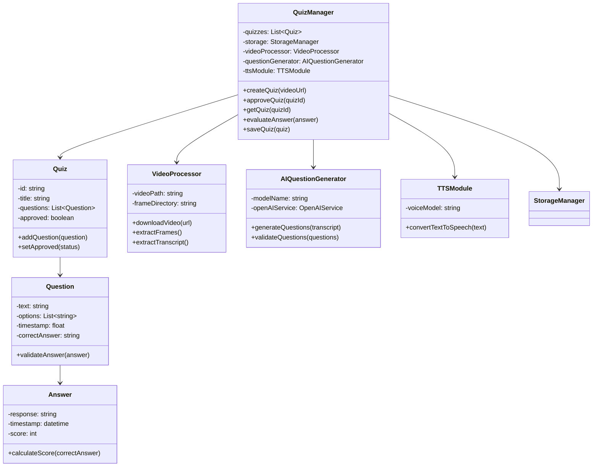
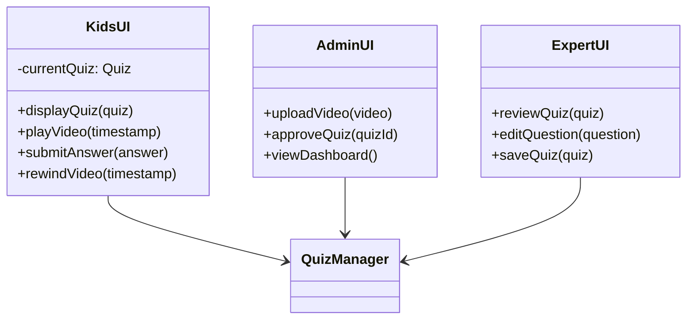
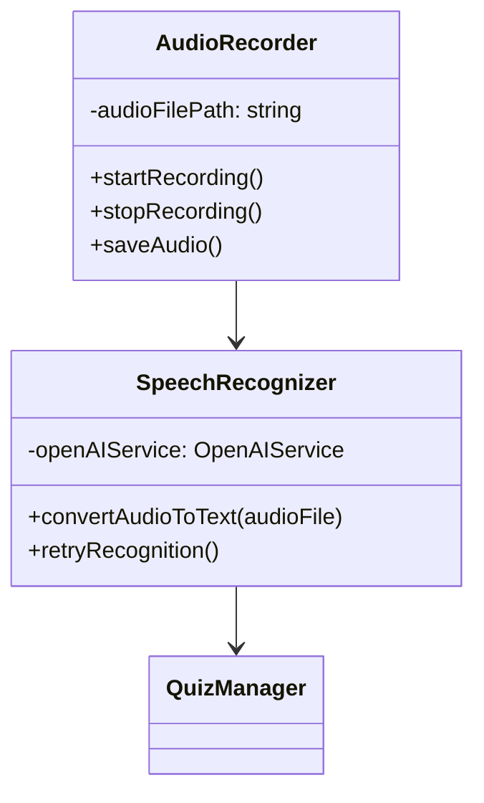
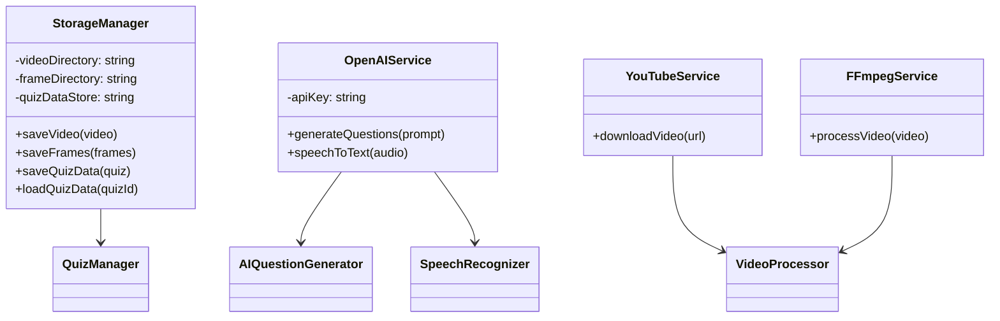

# Class Diagrams

## Backend classes

The backend component manages quiz creation, video processing, 
AI-based question generation, and evaluation of user responses. The QuizManager
acts as the central coordinator and interacts with the VideoProcessor,
AIQuestionGenerator, TTSModule, and StorageManager. The design helps with 
modular processing and responsibility separation.

## Frontend classes

The frontend component provides user interfaces for children, administrators,
and expert reviewers. Each UI class communicates with the backend through
well-defined APIs. Business logic is handled by the backend, which reduces
coupling and improves maintainability.

## Video/Audio pipeline classes

The video and audio processing subsystem enables voice-based interaction.
AudioRecorder captures user speech, while SpeechRecognizer converts audio
to text using external AI services. Recognized answers are then forwarded to the
backend for evaluation.

## Storage and external services

The storage component manages persistent data including videos, frames,
and quiz metadata. External service wrappers encapsulate third-party
integrations like OpenAI, YouTube downloading, and FFmpeg processing,
which reduces direct dependencies within the core application.
