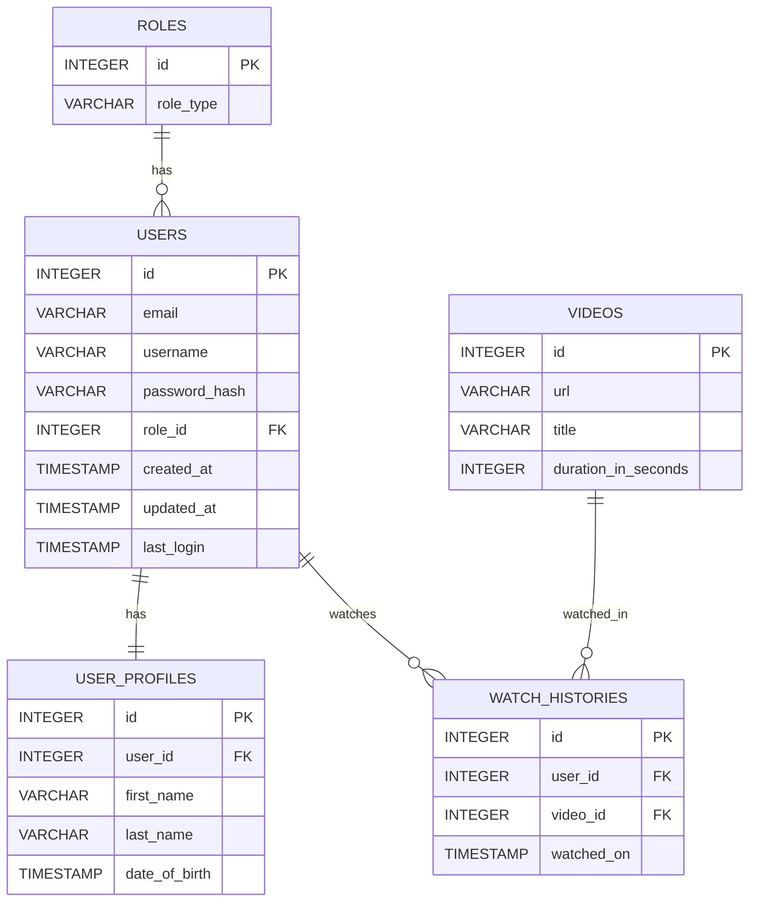

# Design

## Components
### Database
### Entity Relationship Diagram:




Initial database schema:
```
CREATE TABLE roles (
    id INTEGER PRIMARY KEY,
    role_type VARCHAR(30) NOT NULL UNIQUE
);

CREATE TABLE users (
    id INTEGER PRIMARY KEY,
    email VARCHAR(255) NOT NULL UNIQUE,
    username VARCHAR(60) NOT NULL UNIQUE,
    password_hash VARCHAR(255) NOT NULL,
    role_id INTEGER NOT NULL,
    created_at TIMESTAMP DEFAULT CURRENT_TIMESTAMP,
    updated_at TIMESTAMP DEFAULT CURRENT_TIMESTAMP,
    last_login TIMESTAMP,
    FOREIGN KEY (role_id) REFERENCES roles(id)
);

CREATE TABLE user_profiles (
    id INTEGER PRIMARY KEY,
    user_id INTEGER NOT NULL UNIQUE,
    first_name VARCHAR(60),
    last_name VARCHAR(100),
    date_of_birth TIMESTAMP,
    FOREIGN KEY (user_id) REFERENCES users(id) ON DELETE CASCADE
);

CREATE TABLE videos (
    id INTEGER PRIMARY KEY,
    url VARCHAR(2048) NOT NULL,
    title VARCHAR(300) NOT NULL,
    duration_in_seconds INTEGER NOT NULL
);

CREATE TABLE watch_histories (
    id INTEGER PRIMARY KEY,
    user_id INTEGER NOT NULL,
    video_id INTEGER NOT NULL,
    watched_on TIMESTAMP DEFAULT CURRENT_TIMESTAMP,
    FOREIGN KEY (user_id) REFERENCES users(id) ON DELETE CASCADE,
    FOREIGN KEY (video_id) REFERENCES videos(id) ON DELETE CASCADE
);
```
## Piggyback Learning API

**Class Diagram**
I think we should forgo a class diagram for the api for now:
- It’s written in python therefore has no classes
- It’s already developed / difficult to decipher

---

**Backend**
### Framework & Stack
#### Built with Loco.rs, which integrates:
- Axum – Used for Web server and routing
- SeaORM – Uses Database ORM for type-safe SQL queries
- Database: Uses SQLite for lightweight, storage.
- WebSocket support is provided by Axum for real-time communication. 

### Core Functionality
#### Video Processing
- YouTube Downloading: Uses yt-dlp to fetch videos, metadata, and subtitles from a YouTube URL.
- Frame Extraction: Uses FFmpeg to extract key frames from downloaded videos for AI to used during question generation.
- Processing is triggered with API endpoints and progress of processing is streamed to the frontend over WebSockets.

### AI Integration
- Question Generation: Processes video metadata, transcripts/subtitles, and extracted frames to generate questions using AI.
- Answer Validation: Grades user responses (both text and transcribed audio) against expected answers. 
- Gemini 2.5 Flash is integrated for question generation

### Speech Processing
- Speech Recognition: Uses Vosk for transcribing children's audio responses without an internet connection, and to comply with COPPA and other similar laws.
- Model files are stored locally.
- Text-to-Speech (TTS): Has endpoints for generating spoken prompts and feedback for the mascot to handle the quiz.

### Static / Media Serving
Generated assets (the videos, extracted frames, question JSON files) are served statically, and can be access by URL for the frontend to use.

**Frontend**

1. Page rendering : 
This Next.js application uses the App Router. Pages are React components inside app/, and the routing follows Next.js file-system conventions.
Main entry pages (find them in /frontend/app): 
    - kids/[id]
    - login
    - signup
    - videos

2. Frontend tech:
- The UI is built with Next.js (React) and TypeScript.
- Pages are composed from reusable components located in components/.
- Styling is handled via Tailwind CSS and CSS files.
- Shared logic (auth, WebSocket connections) is managed through React Context (context/) and custom hooks (hooks/).

3. Data flow: 
- The browser loads the initial HTML from Next.js.
- Client‑side uses fetch() (or libraries like axios) to call the backend REST API.
- Real‑time updates are delivered with WebSockets using a custom hook/context.

4. Parent page: 
- Processes videos (download, frame extraction, and AI question generation) via API calls.
- Opens a WebSocket connection to stream progress updates in real time (no polling).
- Fetches the available videos and generated questions from the backend.
- Review, edit, and finalize questions via API calls. 

5. Kids page
- Loads the video catalog and quiz data.
- Calls TTS (text‑to‑speech) endpoints for spoken prompts and feedback.
- Record audio responses and transcribes them with backend APIs.

6. Static/Media Serving:
- Static assets are reachable from the public/ directory (Next.js convention).
- videos, extracted frames, question JSON can be reached by the backend and accessed via API routes.
- The frontend doesn't need a separate file server. Next.js serves static assets while Rust serves generated content

---

**Important Distinctions:**
- Documentation/ is a different frontend project: Docusaurus + React.
- That react site is for docs only and has it own build/runtime flow.
- The backend (Loco.rs / Axum) gives both REST APIs and WebSocket endpoints for the frontend. 

---

## Use Case Sequence Diagrams

**Use Case 1 | Answering a Quiz Question**

*As a user, I want to be able to answer quiz questions with voice recognition.*

1. A quiz for the video starts and asks the user a question.
2. The user answers vocally, after seeing a visual indication that voice input is being accepted (“you can speak now!” or something like that).
3. The user's input is mapped to an answer for the quiz.
4. If incorrect, a fallback option is triggered. Potentially a multiple-choice quiz.
5. If correct, the video continues playing.

**Use Case 2 | Assign videos**

*As a parent, I want to search for other users(kid accounts) so I can assign videos and quizzes to them.*

1. The parent opens up a search bar and type in a username/email.
2. The system displays matching accounts.
3. The parent selects the user and types the video name into another search bar for videos.
4. The system displays matching videos.
5. The parent then clicks on the video and a menu pops up.
6. From the menu, the parent chooses fallback options, toggles no distraction mode, and assigns it to the user.
7. User receives the video and gets notified.

**Use Case 3 | View Dashboard**

*As a user/parent, I want a dashboard so I can view the history and quiz performance.*

1. The user clicks on the button for dashboard.
2. The application makes a request to the database for information about the user’s history and quiz performances.
3. The application receives the data and places it into a dashboard.
4. The dashboard is then shown to the user.
5. The user is able to click on individual videos from the dashboard to see detailed stats for past videos watched.
