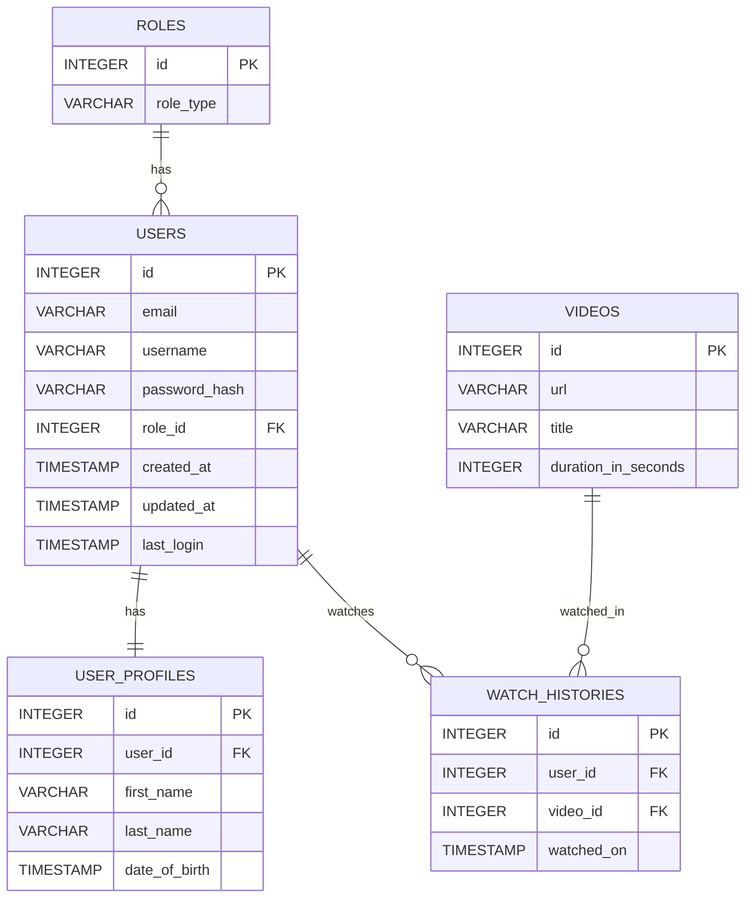
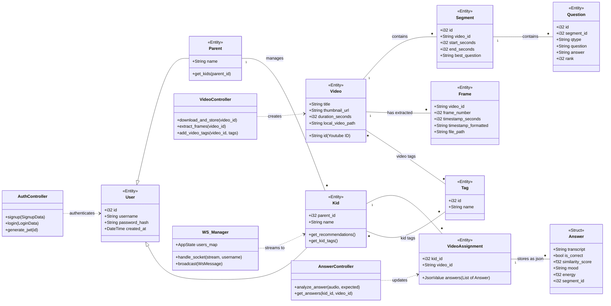

# Design

## Components
### Database
### Entity Relationship Diagram:




Initial database schema:
```
CREATE TABLE roles (
    id INTEGER PRIMARY KEY,
    role_type VARCHAR(30) NOT NULL UNIQUE
);

CREATE TABLE users (
    id INTEGER PRIMARY KEY,
    email VARCHAR(255) NOT NULL UNIQUE,
    username VARCHAR(60) NOT NULL UNIQUE,
    password_hash VARCHAR(255) NOT NULL,
    role_id INTEGER NOT NULL,
    created_at TIMESTAMP DEFAULT CURRENT_TIMESTAMP,
    updated_at TIMESTAMP DEFAULT CURRENT_TIMESTAMP,
    last_login TIMESTAMP,
    FOREIGN KEY (role_id) REFERENCES roles(id)
);

CREATE TABLE user_profiles (
    id INTEGER PRIMARY KEY,
    user_id INTEGER NOT NULL UNIQUE,
    first_name VARCHAR(60),
    last_name VARCHAR(100),
    date_of_birth TIMESTAMP,
    FOREIGN KEY (user_id) REFERENCES users(id) ON DELETE CASCADE
);

CREATE TABLE videos (
    id INTEGER PRIMARY KEY,
    url VARCHAR(2048) NOT NULL,
    title VARCHAR(300) NOT NULL,
    duration_in_seconds INTEGER NOT NULL
);

CREATE TABLE watch_histories (
    id INTEGER PRIMARY KEY,
    user_id INTEGER NOT NULL,
    video_id INTEGER NOT NULL,
    watched_on TIMESTAMP DEFAULT CURRENT_TIMESTAMP,
    FOREIGN KEY (user_id) REFERENCES users(id) ON DELETE CASCADE,
    FOREIGN KEY (video_id) REFERENCES videos(id) ON DELETE CASCADE
);
```

**Class Diagram**


---

**Backend**
### Framework & Stack
#### Built with Loco.rs, which integrates:
- Axum – Used for Web server and routing
- SeaORM – Uses Database ORM for SQL queries
- Database: Uses SQLite for lightweight, storage.
- WebSocket support is provided by Axum for real-time communication. 

### Core Functionality
#### Video Processing
- YouTube Downloading: Uses yt-dlp to fetch videos, metadata, and subtitles from a YouTube URL.
- Frame Extraction: Uses FFmpeg to extract frames from downloaded videos for AI to used during question generation.
- Processing is done with API endpoints and progress of processing is streamed to the frontend over WebSockets.

### AI Integration
- Question Generation: Processes video metadata, transcripts/subtitles, and extracted frames to generate questions using AI.
- Answer Validation: Grades user responses (both text and transcribed audio) against expected answers. 
- OpenAI is integrated for question generation

### Speech Processing
- Speech Recognition: Uses Vosk for transcribing children's audio responses without an internet connection, and to comply with COPPA and other similar laws.
- Model files are stored locally.
- Text-to-Speech (TTS): Has endpoints for generating spoken prompts and feedback for the mascot to handle the quiz.

### Static / Media Serving
Generated assets (the videos, extracted frames, question JSON files) are served statically, and can be access by URL for the frontend to use.

**Frontend**

1. Page rendering : 
This Next.js application uses the App Router. Pages are React components inside app/, and the routing follows Next.js file-system conventions.
Main entry pages (find them in /frontend/app): 
    - kids/[id]
    - login
    - signup
    - videos

2. Frontend Technology:
- The UI is built with Next.js (React) and TypeScript.
- Pages are composed from reusable components located in components/.
- Styling is handled via Tailwind CSS and CSS files.
- Shared logic (auth, WebSocket connections) is managed through React Context (context/) and custom hooks (hooks/).

3. Data flow: 
- The browser loads the initial HTML from Next.js.
- Client‑side uses fetch() (or libraries like axios) to call the backend REST API.
- Real‑time updates are delivered with WebSockets using a custom hook/context.

4. Parent page: 
- Processes videos (download, frame extraction, and AI question generation) via API calls.
- Opens a WebSocket connection to stream progress updates in real time (no polling).
- Fetches available videos and generated questions from the backend.
- Review, edit, and finalize questions via API calls. 

5. Kids page
- Loads the video catalog and quiz data.
- Calls TTS (text‑to‑speech) endpoints for spoken prompts and feedback.
- Record audio responses and transcribes them with backend APIs.

6. Static/Media Serving:
- Static assets are reachable from the public/ directory (Next.js convention).
- videos, extracted frames, question JSON can be reached by the backend and accessed via API routes.
- Next.js serves static assets while Rust serves the generated content

---

**Important Distinctions:**
- Documentation/ is a different frontend project: Docusaurus + React.
- That react site is for docs only and has it own build/runtime flow.
- The backend (Loco.rs / Axum) gives both REST APIs and WebSocket endpoints for the frontend. 

---
