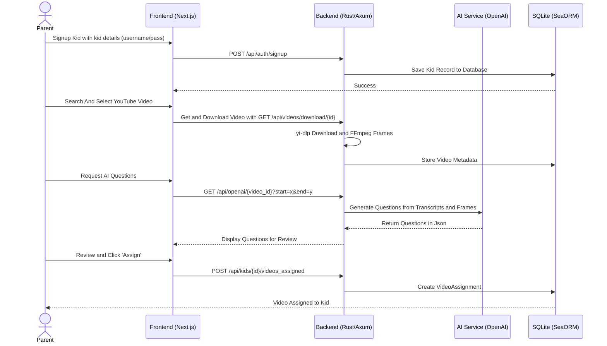
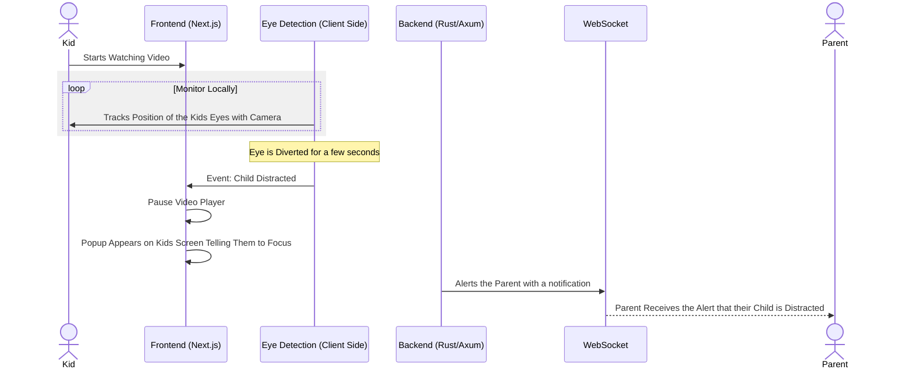
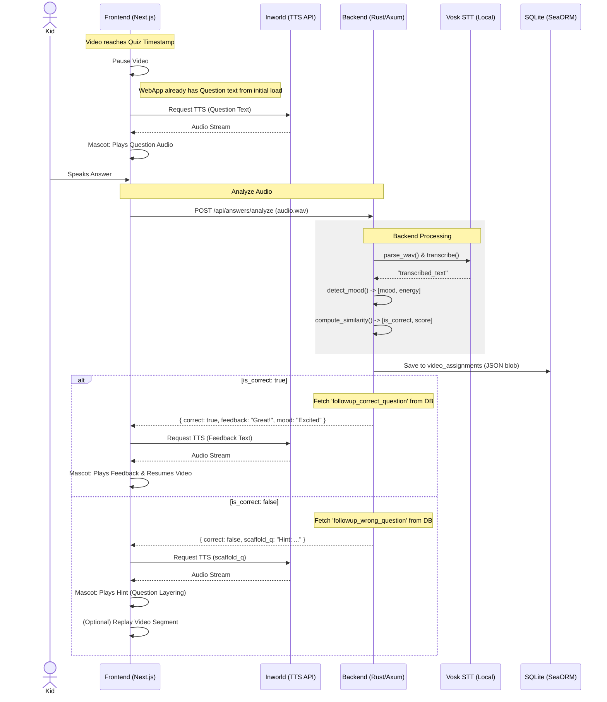
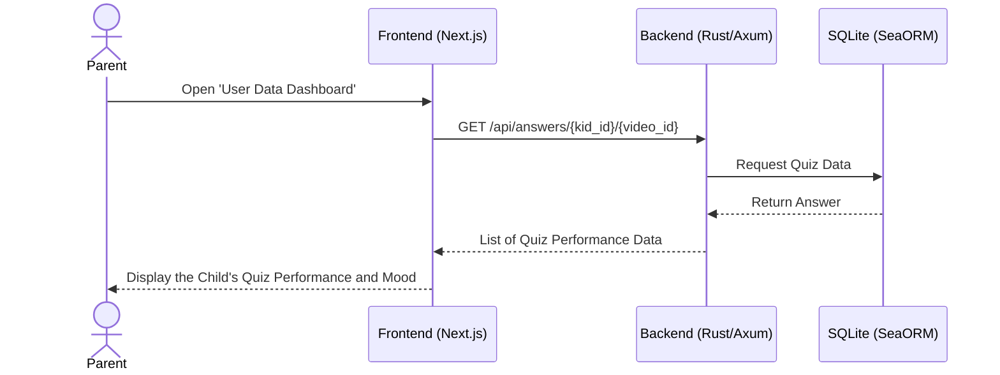
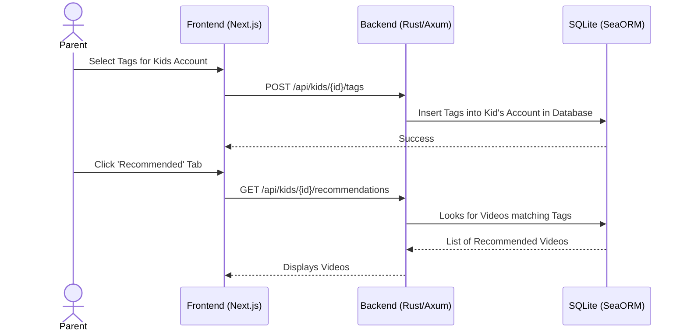

# Sequence Diagrams

## Sequence Diagrams representing the Use Cases
### Use case 1 - Add children to my account and assign videos to them

```mermaid
sequenceDiagram
    actor Parent
    participant WebApp as Frontend (Next.js)
    participant API as Backend (Rust/Axum)
    participant AI as AI Service (OpenAI)
    participant DB as SQLite (SeaORM)
    
    Parent->>WebApp: Signup Kid with kid details (username/pass)
    WebApp->>API:  POST /api/auth/signup
    API->>DB: Save Kid Record to Database
    DB-->>WebApp: Success

    Parent->>WebApp: Search And Select YouTube Video
    WebApp->>API: Get and Download Video with GET /api/videos/download/{id}
    API->>API: yt-dlp Download and FFmpeg Frames
    API->>DB: Store Video Metadata
    
    Parent->>WebApp: Request AI Questions
    WebApp->>API: GET /api/openai/{video_id}?start=x&end=y
    API->>AI: Generate Questions from Transcripts and Frames
    AI-->>API: Return Questions in Json
    API-->>WebApp: Display Questions for Review

    Parent->>WebApp: Review and Click 'Assign'
    WebApp->>API: POST /api/kids/{id}/videos_assigned
    API->>DB: Create VideoAssignment
    DB-->>Parent: Video Assigned to Kid
```

### Use Case 2- Detect if my child is paying attention to the video

```mermaid
sequenceDiagram
    actor Kid
    participant WebApp as Frontend (Next.js)
    participant Eye as Eye Detection (Client Side)
    participant API as Backend (Rust/Axum)
    participant WS as WebSocket
    actor Parent

    Kid->>WebApp: Starts Watching Video
      rect rgb(240, 240, 240)
      loop Monitor Locally
          Eye->>Kid: Tracks Position of the Kids Eyes with Camera
      end
    end

    Note over Eye: Eye is Diverted for a few seconds
    Eye->>WebApp: Event: Child Distracted
    
    WebApp->>WebApp: Pause Video Player
    WebApp->>WebApp: Popup Appears on Kids Screen Telling Them to Focus
    

    API->>WS: Alerts the Parent with a notification
    WS-->>Parent: Parent Receives the Alert that their Child is Distracted

```

### Use Case 3 - Answering a Quiz Question with voice recognition

```mermaid
sequenceDiagram
    actor Kid
    participant WebApp as Frontend (Next.js) 
    participant Inworld as Inworld (TTS API)
    participant API as Backend (Rust/Axum)
    participant Vosk as Vosk STT (Local)
    participant DB as SQLite (SeaORM)

    Note over WebApp: Video reaches Quiz Timestamp
    WebApp->>WebApp: Pause Video
    
    Note right of WebApp: WebApp already has Question text from initial load
    WebApp->>Inworld: Request TTS (Question Text)
    Inworld-->>WebApp: Audio Stream
    WebApp->>WebApp: Mascot: Plays Question Audio
    
    Kid->>WebApp: Speaks Answer
    
    Note over WebApp, API: Analyze Audio
    WebApp->>API: POST /api/answers/analyze (audio.wav)
    
    rect rgb(240, 240, 240)
        Note over API, Vosk: Backend Processing
        API->>Vosk: parse_wav() & transcribe()
        Vosk-->>API: "transcribed_text"
        API->>API: detect_mood() -> [mood, energy]
        API->>API: compute_similarity() -> [is_correct, score]
    end
    
    API->>DB: Save to video_assignments (JSON blob)
    
    alt is_correct: true
        Note over API: Fetch 'followup_correct_question' from DB
        API-->>WebApp: { correct: true, feedback: "Great!", mood: "Excited" }
        WebApp->>Inworld: Request TTS (Feedback Text)
        Inworld-->>WebApp: Audio Stream
        WebApp->>WebApp: Mascot: Plays Feedback & Resumes Video
    else is_correct: false
        Note over API: Fetch 'followup_wrong_question' from DB
        API-->>WebApp: { correct: false, scaffold_q: "Hint: ..." }
        WebApp->>Inworld: Request TTS (scaffold_q)
        Inworld-->>WebApp: Audio Stream
        WebApp->>WebApp: Mascot: Plays Hint (Question Layering)
        WebApp->>WebApp: (Optional) Replay Video Segment
    end
```
### Use Case 4 - View Quiz Results for Kids

```mermaid
sequenceDiagram
    actor Parent
    participant WebApp as Frontend (Next.js)
    participant API as Backend (Rust/Axum)
    participant DB as SQLite (SeaORM)

    Parent->>WebApp: Open 'User Data Dashboard'
    WebApp->>API: GET /api/answers/{kid_id}/{video_id}
    API->>DB:  Request Quiz Data
    DB-->>API: Return Answer
    
    API-->>WebApp: List of Quiz Performance Data
    WebApp-->>Parent: Display the Child's Quiz Performance and Mood 
```
### Use case 5 - Add tags to Kids Accounts

```mermaid
sequenceDiagram
    actor Parent
    participant WebApp as Frontend (Next.js)
    participant API as Backend (Rust/Axum)
    participant DB as SQLite (SeaORM)

    Parent->>WebApp: Select Tags for Kids Account
    WebApp->>API: POST /api/kids/{id}/tags
    API->>DB: Insert Tags into Kid's Account in Database
    DB-->>WebApp: Success

    Parent->>WebApp: Click 'Recommended' Tab
    WebApp->>API: GET /api/kids/{id}/recommendations
    API->>DB: Looks for Videos matching Tags
    DB-->>API: List of Recommended Videos
    API-->>WebApp: Displays Videos
```    
