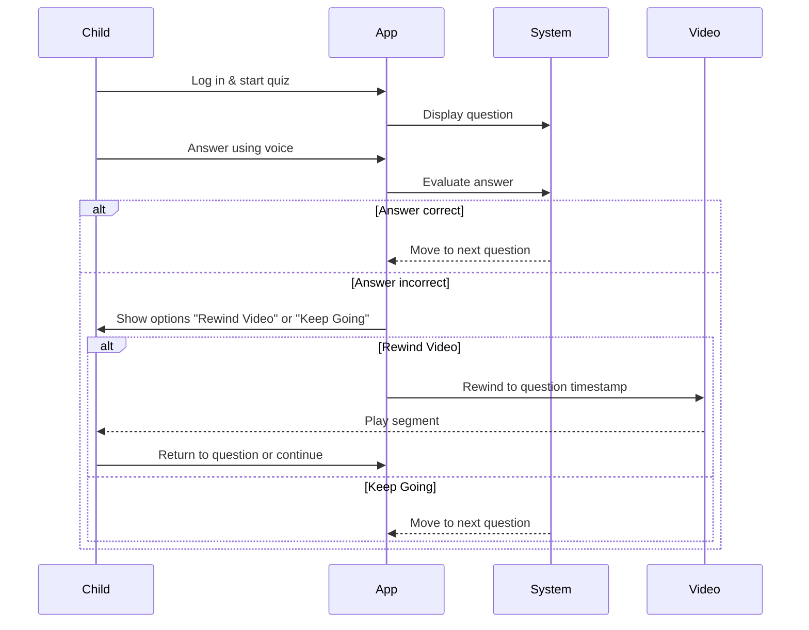

# Sequence Diagrams

## Use case 1 - Admin creates quiz

## Use case 2 - Learner watches the video and answers quiz

## Use case 3 - Learner answers a question using voice

## Use case 4 - Track progress

## Use case 5 - Parental report

## Use case 6 - Expert review

